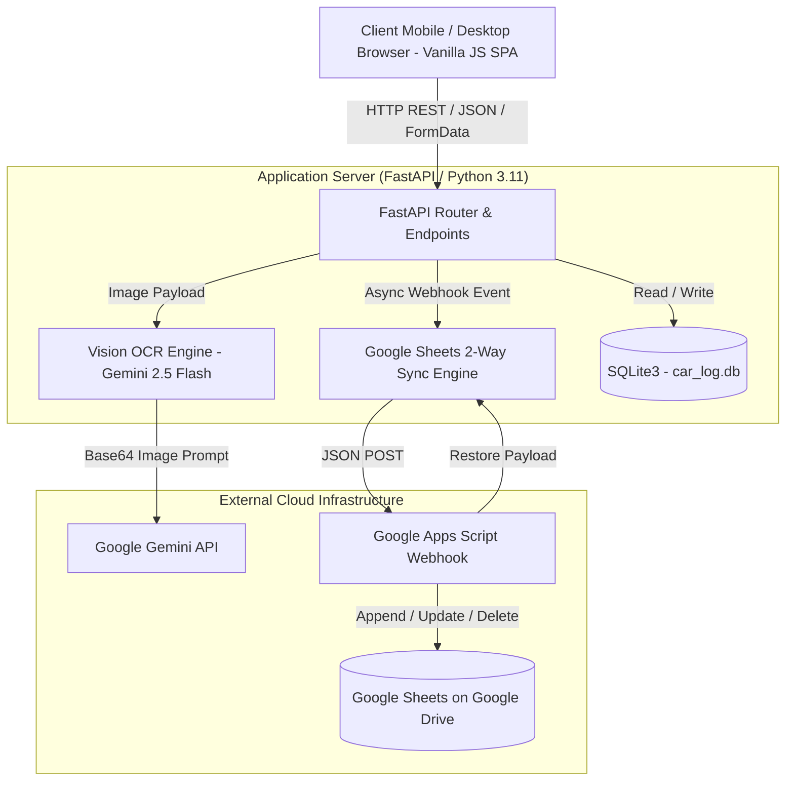
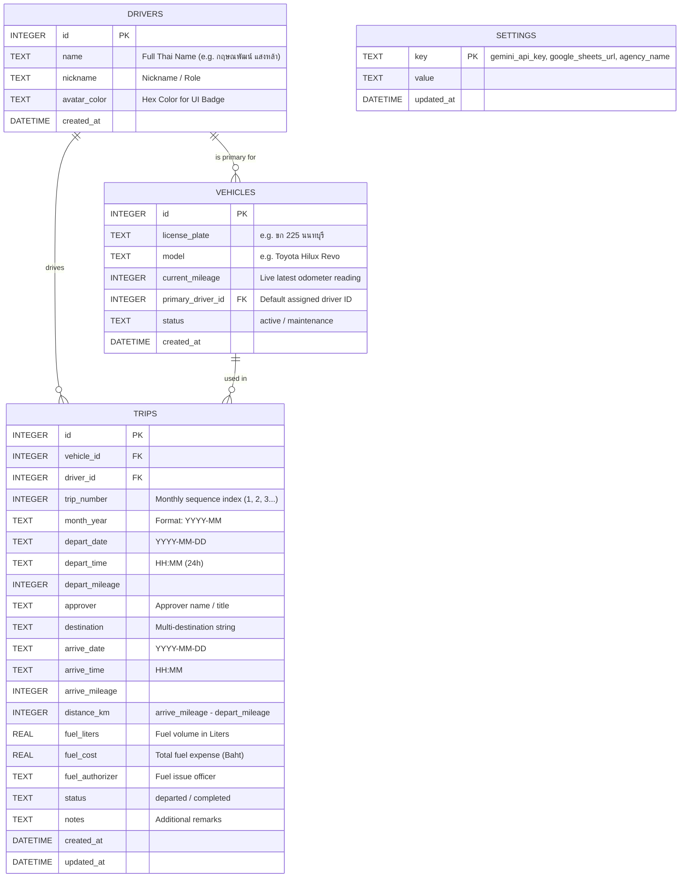

# 🛠️ Technical Architecture & System Specification
## Project: MOC Phetchaburi Smart Vehicle Logbook (แบบ 4)
**Repository:** `pohlor27-cpu/moc-carlog-`  
**Target Environment:** Linux / Render Cloud / Google Drive (Google Apps Script)  
**Document Purpose:** Complete technical reference and architecture blueprint for code review, AI co-analysis, and system expansion.

---

### 1. High-Level Architecture Overview



---

### 2. Technology Stack & Dependencies

| Component | Technology / Library | Description & Version |
| :--- | :--- | :--- |
| **Backend Core** | Python 3.11 + FastAPI | Asynchronous ASGI RESTful API framework |
| **ASGI Server** | Uvicorn | High-performance ASGI production server |
| **Database** | SQLite3 (Embedded) | Relational database with Foreign Keys & WAL mode |
| **AI / OCR Layer** | Google Gemini Vision API | `gemini-2.5-flash` / `gemini-1.5-flash` for odometer digit extraction |
| **Cloud Storage** | Google Drive / Google Sheets | Serverless persistence via Google Apps Script (doPost / doGet) |
| **Frontend UI** | Vanilla HTML5 / ES6+ / CSS3 | Zero-dependency SPA, Mobile-First PWA-ready design |
| **Print / PDF Engine** | CSS Paged Media + `html2canvas 1.4.1` | Exact A4 Landscape (297mm × 210mm) rendering & 2x Ultra HD PNG export |
| **Typography** | Google Fonts (Sarabun, Prompt) | Thai Government standard typography for official Form 4 |

---

### 3. Database Schema & Data Models (SQLite3)



---

### 4. Core Algorithms & Business Logic

#### 4.1. Ad-hoc vs Primary Driver Tagging & Foolproof Profile Coupling (`server.py` & `app.js`)
* **Vehicle-to-Driver Master Assignment:**
  - Car 1 (`ขก 225`) ➔ Driver 1: กฤษณพัฒน์ แสงหล้า
  - Car 2 (`กอ 409`) ➔ Driver 2: ประภาส ปักกิ่งเมือง
  - Car 3 (`ขก 192`) ➔ Driver 3: ธรรมรัตน์ สุรเดชานนท์
  - Car 4 (`นจ 4648`) ➔ Driver 4: อนุพงศ์ บุญมาก
* **Foolproof Profile-Coupling UX:**
  - When any driver taps a Driver Profile Card on the home dashboard, the system automatically locks the active vehicle to that driver's assigned car.
  - In Departure & Manual modals, all vehicle dropdown options explicitly label `(รถประจำ: [ชื่อ ผขร.])` alongside current mileage.
  - If a driver drives another vehicle (e.g. ธรรมรัตน์ drives ขก 225), they simply tap กฤษณพัฒน์'s card, click "บันทึกเวลาออก", and select their own name from the driver dropdown.
* **Condition & Automatic Tagging:**
  ```python
  is_ad_hoc = (trip["driver_id"] != vehicle["primary_driver_id"])
  if is_ad_hoc:
      trip["driver_name"] = f"{driver['name']} (ผู้ขับขี่เฉพาะกิจ)"
  ```
* **Frontend Rendering:**
  In Form 4 PDF table, the ad-hoc label is cleanly decoupled into 2 sub-lines (`line-height: 1.1`, sub-label `font-size: 7.5pt`) to prevent vertical row overflow.

#### 4.2. Form 4 Dynamic 10-Row Pagination Engine
* **A4 Landscape Constraints:** Height: 210mm. Margins: 6mm top/bottom ➔ Usable Height = 198mm.
* **Component Heights:** Header (~42mm) + Table Thead (~14mm) + Footer Summary/Signature (~36mm) = 92mm fixed.
* **Available Table Body Height:** ~106mm.
* **Row Height:** 10.5mm per multi-line row.
* **Algorithm:**
  ```javascript
  const ROWS_PER_PAGE = 10;
  if (trips.length <= ROWS_PER_PAGE) {
      // 1 Page: pad with empty rows up to 10
      renderSinglePage(padRows(trips, 10));
  } else {
      // Multi Page: chunk into arrays of 10 items
      const pages = chunkArray(trips, ROWS_PER_PAGE);
      pages.forEach((pageTrips, pageIdx) => {
          renderPage(pageTrips, pageIdx + 1, pages.length, isLastPage);
      });
  }
  ```

#### 4.3. Real-time Google Sheets 2-Way Sync Protocol (`google_sync.py` & `google_apps_script.js`)
1. **Real-time Event Hook (Server-to-Google Sheets):**
   - On `record_departure`, `record_arrival`, `manual_trip`, `update_trip`:
     Trigger asynchronous HTTP `POST` to Google Apps Script Webhook with payload:
     ```json
     {
       "action": "upsert",
       "trip": { ...trip_metadata... }
     }
     ```
2. **Sheet Deduplication & Upsert Logic (Apps Script):**
   - Target Sheet matches vehicle plate (or unified master sheet).
   - Searches Column A (`Trip ID`). If exists ➔ Updates row cells; If not ➔ Appends new row.
3. **Disaster Recovery (Restore):**
   - `POST /api/google/restore` requests all rows from Apps Script `action=getAll` and overwrites/rebuilds local SQLite tables cleanly.

---

### 5. API Endpoints Reference

| Method | Endpoint | Description | Payload / Params |
| :--- | :--- | :--- | :--- |
| `GET` | `/api/vehicles` | List all vehicles with live mileage & primary driver | - |
| `PUT` | `/api/vehicles/{id}` | Update vehicle baseline/current mileage | `{"current_mileage": 52204}` |
| `GET` | `/api/drivers` | List 4 official drivers & colors | - |
| `GET` | `/api/trips/active` | Get currently ongoing trips (vehicles on the road) | - |
| `POST` | `/api/trips/depart` | Record trip departure | `FormData: vehicle_id, driver_id, destination, mileage, date, time` |
| `POST` | `/api/trips/{id}/arrive` | Record trip arrival & distance calc | `FormData: arrive_mileage, date, time, approver, fuel` |
| `POST` | `/api/trips/manual` | Full manual trip creation (bypass active stage) | `FormData: all trip fields` |
| `PUT` | `/api/trips/{id}` | Direct edit trip record | `FormData: all trip fields` |
| `DELETE`| `/api/trips/{id}` | Delete trip & trigger Google Sheet delete | - |
| `GET` | `/api/report/form4` | Compute Thai Gov Form 4 report metadata | `vehicle_id, month (YYYY-MM)` |
| `POST` | `/api/ocr/odometer` | AI Gemini Vision Odometer Digit OCR | `File: image` |
| `GET` | `/api/settings` | Get system settings & masked URLs | - |
| `POST` | `/api/settings` | Save Gemini Key, Webhook URL, Agency Name | `JSON` |
| `POST` | `/api/google/sync-all` | Batch sync entire SQLite database to Google Sheets | - |
| `POST` | `/api/google/restore` | Pull Google Sheets data down to SQLite | - |

---

### 6. Security, Resilience & Handover Blueprint

1. **Role-Based UI Isolation:**
   - Client JS checks `selectedDriverId`. Only **Driver 1 (กฤษณพัฒน์ แสงหล้า - Primary Admin)** sees the `⚙️ เชื่อมต่อ Google Drive` management trigger.
   - Drivers 2–4 get a simplified, tamper-proof interface focused purely on Departure/Arrival logs.
2. **Ephemeral Cloud Storage Immunity:**
   - Even if free-tier cloud containers (Render) reboot or rebuild from git, data is continuously mirrored onto Google Sheets on Google Drive.
3. **Office Handover Protocol:**
   - To transfer ownership to the Office: Share the Google Sheet with the Office's Official Google Account and click **"Transfer Ownership"**.
   - Paste the new Webhook URL into `/api/settings` once. Zero code modifications required.
